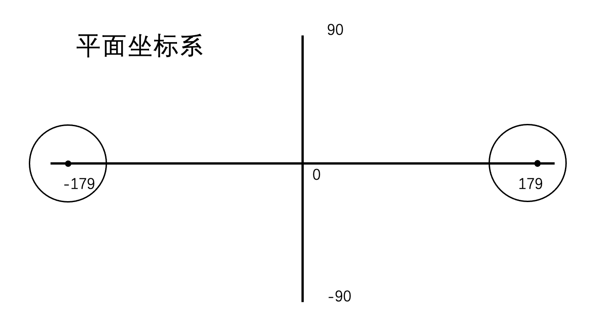
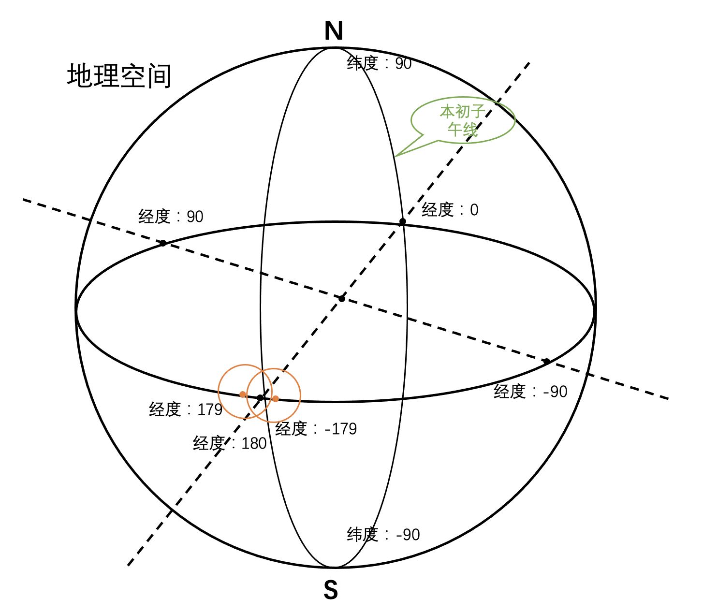

# 平面坐标系与空间坐标系下面的几何关系
地理空间图形的关系也与平面坐标系不同。在下面的例子中，圆形跨越了180度经线，同样参数的两个圆形，在平面坐标系不相交，在地理空间则是相交。如果用平面坐标系的算法，需要进行换算
<br>
<br>
# 测试
```java
package com.leokok.spatial4j.learning;

import org.locationtech.spatial4j.context.SpatialContext;
import org.locationtech.spatial4j.context.SpatialContextFactory;
import org.locationtech.spatial4j.shape.Circle;
import org.locationtech.spatial4j.shape.Point;
import org.locationtech.spatial4j.shape.impl.CircleImpl;
import org.locationtech.spatial4j.shape.impl.PointImpl;

/**
 * 平面坐标系与空间坐标系下面几何关系
 */
public class ShapeRelateTest {

    public static void main(String[] args) {
        SpatialContextFactory nonGeoContextFactory = new SpatialContextFactory();
        nonGeoContextFactory.geo = false;
        SpatialContext nonGeoContext = nonGeoContextFactory.newSpatialContext();

        // 平面坐标系中的圆
        Point pointLeft = new PointImpl(-179, 0, nonGeoContext);
        Point pointRight = new PointImpl(179, 0, nonGeoContext);
        Circle circleLeft = new CircleImpl(pointLeft, 10, nonGeoContext);
        Circle circleRight = new CircleImpl(pointRight, 10, nonGeoContext);
        System.out.println("平面坐标系下面圆的关系: " + circleLeft.relate(circleRight));

        // 地理空间中的圆
        Point geoCenterWest = new PointImpl(-179, 0, SpatialContext.GEO);
        Point geoCenterEast = new PointImpl(179, 0, SpatialContext.GEO);
        Circle geoCircleWest = new CircleImpl(geoCenterWest, 10, SpatialContext.GEO);
        Circle geoCircleEast = new CircleImpl(geoCenterEast, 10, SpatialContext.GEO);
        System.out.println("地理空间中的圆的关系: " + geoCircleWest.relate(geoCircleEast));
    }


}
//结果
//平面坐标系下面圆的关系: DISJOINT
//地理空间中的圆的关系: INTERSECTS
```