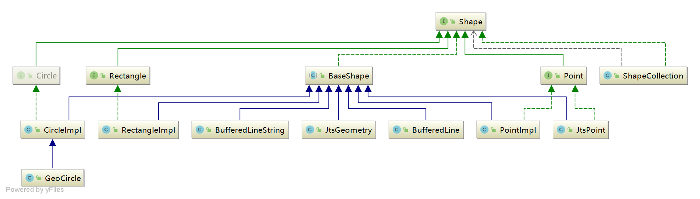

# org.locationtech.spatial4j.shape使用说明
spatial4j提供的核心几何对象
## 类结构图
 
## 说明
Shape底层，提供了共用接口方法:relate、getBoundingBox、hasArea、getArea、getCenter、getBuffered、isEmpty、getContext等方法 
Circle圆形几何结构 
Rectangle矩形结构 
point、linestring等通过jts来支持
